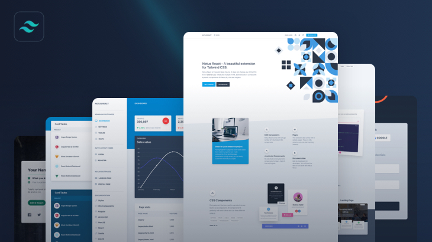

# 🚀 MDM Web Designing Practical Repository


<p align="center">
  
</p>

<h1 align="center">🚀 MDM Web Designing Practical Repository</h1>

<p align="center">
  
  
  
  
  
  
</p>

<p align="center">
  <a href="https://prajwalprajapati.github.io/MDM-Web-Designing/">
    
  </a>
</p>
A curated collection of my **MDM Web Designing laboratory practicals** demonstrating modern front-end development, responsive layouts, and Tailwind CSS implementation.

---

## 📚 Course Information

* **Course:** MDM Web Designing
* **Program:** B.Tech Computer Science Engineering
* **Student:** Prajwal Prajapati

---

## 🛠️ Technologies Used

* HTML5
* CSS3
* JavaScript
* Tailwind CSS
* Responsive Web Design

---

## 📂 Repository Structure

```text
MDM-Web-Designing/
├── Practical-1/
├── Practical-2/
├── Practical-3/
├── Practical-4/
├── Practical-5/
├── Practical-6/
├── Practical-7/
└── Practical-8/
```

---

## 🎯 Objective

This repository is being continuously updated with all **8 MDM Web Designing practical assignments** and related project files. Each practical focuses on different aspects of front-end web development, including layout design, styling, responsiveness, UI components, and modern web technologies.

---

## 📈 Current Progress

* Repository Created ✅
* Practical Folders Created 🔄
* Files Upload in Progress 🔄
* Documentation Ongoing 🔄

---

## 👨‍💻 Author

**Prajwal Prajapati**
B.Tech CSE Student | Front-End Web Development Enthusiast

---

⭐ This repository is actively maintained as part of my academic coursework and web development learning journey.
